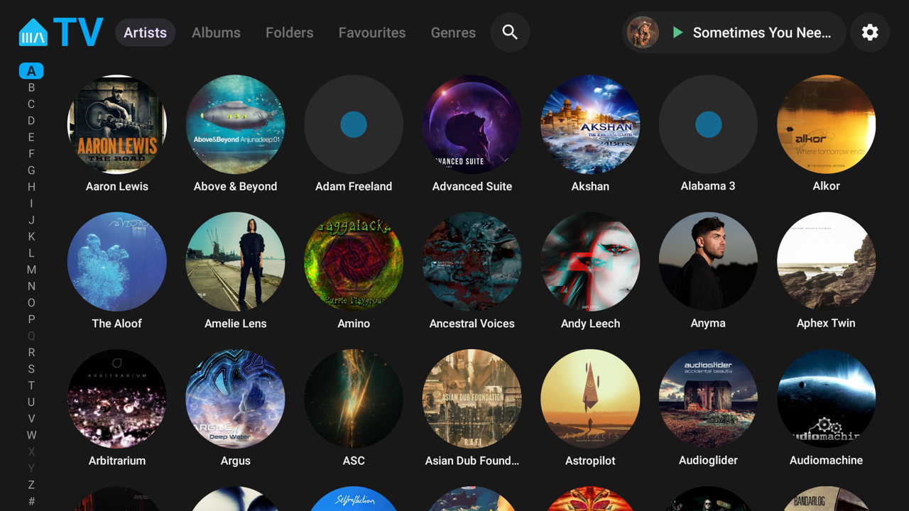
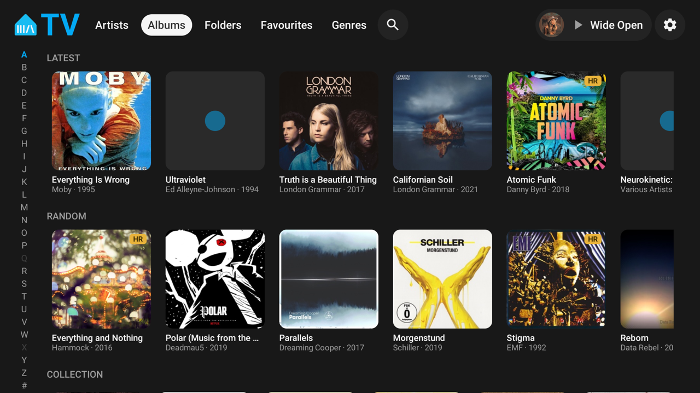
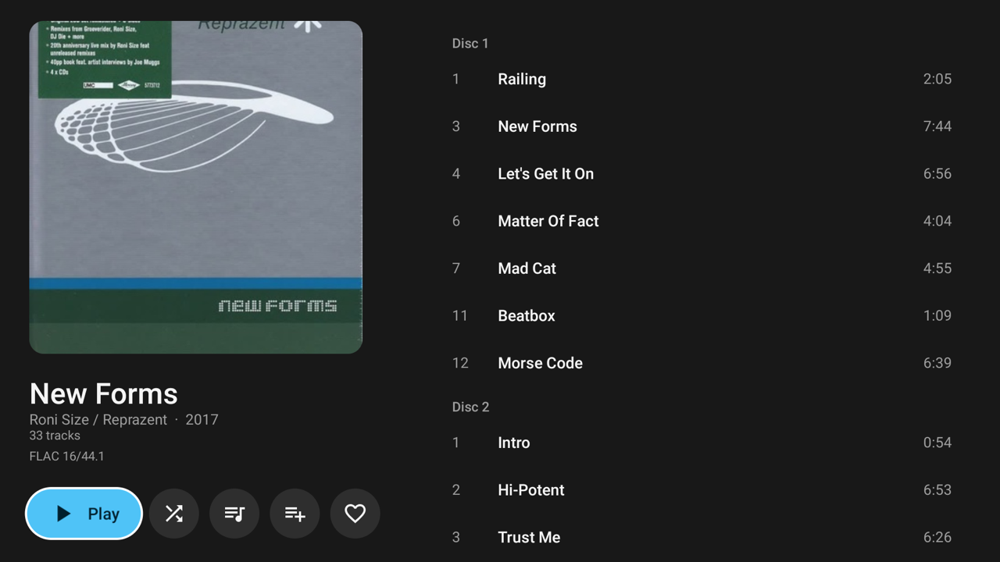
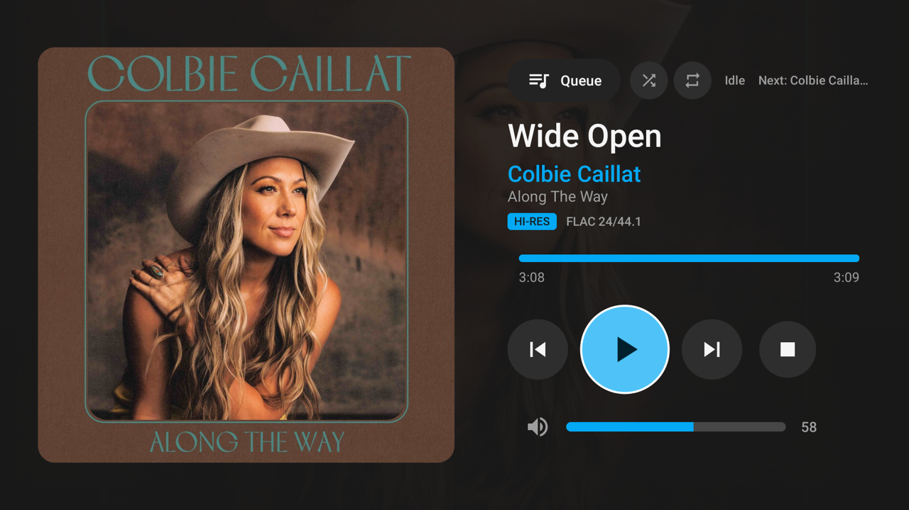

# MATV

**M**usic **A**ssistant **TV** — an Android TV controller for
[Music Assistant](https://music-assistant.io). Sign in with your Music Assistant
account, browse the library, drive playback from the sofa. Controller only: audio
plays on your existing Music Assistant endpoints.









Shot on a Sony BRAVIA at 1920x1080.

## Install

Download `app-release.apk` from the
[latest release](https://github.com/superthom196/matv-android/releases/latest).

Requires Android TV / Google TV / Fire OS, API 28+. It is not on the Play Store, so allow
installs from unknown sources if your TV asks. Upgrading from a build signed with a
different key needs `adb uninstall io.github.superthom196.matv` first — that applies to
anyone who has a pre-1.0 build.

### With a computer (any TV)

```bash
adb connect <tv-ip>:5555
adb install app-release.apk
```

### Without a computer (any TV)

Install **Send files to TV** on both your phone and the TV — it is free on the Amazon
Appstore and the Play Store. Put the APK on your phone, open the app on both ends, send
from phone, receive on TV, then open the received file to install. No URL, no hosting, no
computer, and it all stays on your LAN.

It is also the easy path to pass the app to someone else: send them the APK over
Signal/WhatsApp/email, they save it to their phone, then push it to their TV.

If you would rather type a URL, **Downloader** (Amazon Appstore) installs from any direct
link, including the release asset above.

### Fire TV / Firestick

Works on Android-based Fire TV hardware — Fire OS 7 and 8, which covers the Stick 4K,
Stick 4K Max, Stick 3rd gen, and Cube 2nd gen and later. It does **not** run on Fire OS 5
or 6 (Stick 2nd gen, Cube 1st gen), which are below API 28, nor on Amazon's Vega OS
devices such as the Fire TV Stick 4K Select — Vega is not Android and cannot install APKs
at all.

Fire OS hides both switches you need behind Developer Options. Go to **Settings -> My Fire
TV -> About**, click your device name seven times, then back out one level to **Developer
Options** and turn on **ADB debugging** and **Apps from Unknown Sources**. Only the second
one matters if you are installing via Send files to TV; both matter for the adb route. The
stick's IP is under **Settings -> My Fire TV -> About -> Network**.

Fire remotes have no dedicated menu or colour keys, but everything here is D-pad, Back,
Select and the media transport keys, all of which the Alexa Voice Remote sends. Long-press
Select still opens the play options.

## Build from source

Only needed if you want to change the code — most people should use the release APK above.

```bash
./build.sh
```

`build.sh` sets `JAVA_HOME` to Android Studio's bundled JDK (if not already set) and runs
`./gradlew assembleRelease`. The release build is minified (R8) and, unless a signing key is
configured (below), debug-signed and not Play-ready. Requires a JDK 17+ and the Android SDK
with Platform 37 and Build-Tools 36.
If Gradle can't find a JDK on your machine, set `org.gradle.java.home` in your own
`~/.gradle/gradle.properties` (not the project's, which is committed).

```bash
TV=<tv-ip>:5555 ./build.sh install
```

Also installs and AOT-compiles the app and launches it on the TV at `TV`. Use this
**release** build, not a debug build straight from Android Studio — the unminified
debug APK is large enough that ART's dex verification alone can cause an ANR on
slower TV hardware. Gradle needs a big heap for R8 (`org.gradle.jvmargs=-Xmx8g` is
set); with 3 GB it thrashes for 10+ minutes.

## Releases are built by CI

Every push to `main` and every pull request runs `assembleRelease` on GitHub Actions and keeps
the APK as a workflow artifact, so a broken build shows up without anyone building it by hand.
That build is debug-signed; it is a check, not something to install.

Pushing a tag builds the APK, signs it with the project's release key and attaches it to that
tag's release — to the release if you have already written one, otherwise to a draft it creates
for you to write notes on:

```bash
git tag -a v0.6.0 -m "..." && git push --follow-tags
```

This needs four repository secrets. Generate a keystore once and keep it somewhere safe — lose
it and every installed copy has to be uninstalled before it can be upgraded again:

```bash
keytool -genkeypair -v -keystore matv-release.jks -alias matv \
  -keyalg RSA -keysize 2048 -validity 10000
base64 -i matv-release.jks | pbcopy
```

Then `gh secret set KEYSTORE_BASE64` (paste the base64), plus `KEYSTORE_PASSWORD`, `KEY_ALIAS`
and `KEY_PASSWORD`. Keep the `.jks` out of the repo; `.gitignore` already covers it.

To sign local builds with the same key — worth doing, so a build from your machine installs
over a CI one instead of colliding with it — put a `signing.properties` in the repo root
(gitignored):

```properties
storeFile=/absolute/path/to/matv-release.jks
storePassword=...
keyAlias=matv
keyPassword=...
```

With neither the secrets nor that file, nothing changes: release builds stay debug-signed.

## First run

1. The app scans your LAN for Music Assistant (`GET /info` on :8095 and mDNS). Pick a server or type its address.
2. Sign in with your Music Assistant username and password. The TV keeps a long-lived token afterwards.
3. Choose which player to drive. Change it any time from Settings (the gear).

## Browsing

- **Artists** (default tab) and **Albums**: library grids with artwork and an A–Z rail down the left
  edge. Up/Down on the rail steps between letters (the grid follows), Right or OK enters the grid at
  that letter, Left from the first column returns to the rail. Albums sort by artist, then title.
  Artists without their own image borrow one of their album covers.
- **Folders**: the folder tree of your collection, as Music Assistant's Browse page shows it.
  OK on a folder opens it, Back goes up a level. OK on a track plays that track and the rest of the folder.
- **Favourites**: your favourite artists, albums, tracks and playlists.
- **Genres**: the genres your own albums carry, biggest first, read off their tracks by a background
  scan (the server's genre list only lends the artwork). OK opens a genre's albums.
- **Playlists** and **Radio** tabs can be switched on in Settings; any tab can be switched off there.
- **Search** (magnifier in the header): artists, albums, tracks, playlists and radio in your library.
- **Long-press OK** on anything playable for Play now / Play next / Add to queue / Shuffle / Favourite.
- **Now Playing**: artwork, what is actually streaming (codec, bit depth, rate, a HI-RES mark), transport,
  shuffle and repeat toggles, and a progress bar that seeks 15 s per Left/Right press while it has focus.
- **Queue** (from Now Playing): what the selected player has queued, current track highlighted. OK jumps to
  a track; long-press to move it up or down or remove it; Clear empties the queue.
- **Media keys** on the remote work on every screen, and the app registers a media session so they keep
  working while another app is in front.
- **Settings** (gear in the header): the players Music Assistant has found (OK selects, long-press syncs or
  unsyncs), a rescan of the library, the hi-res scan's progress, the library cache, default tab, which tabs
  show, server and version info, sign out.

## Layout

- `app/src/main/java/io/github/superthom196/matv/ma` — WebSocket client, models, discovery, artwork URLs, saved settings.
- `app/src/main/java/io/github/superthom196/matv/ui` — Compose for TV screens.
- `app/src/main/java/io/github/superthom196/matv/AppViewModel.kt` — app state, transport commands, event handling.
- [`docs/PROTOCOL.md`](docs/PROTOCOL.md) — the verified Music Assistant protocol facts this was built from.

## License

Copyright (C) 2026 superthom196. Licensed under the GNU General Public License v3.0 —
see [LICENSE](LICENSE).
